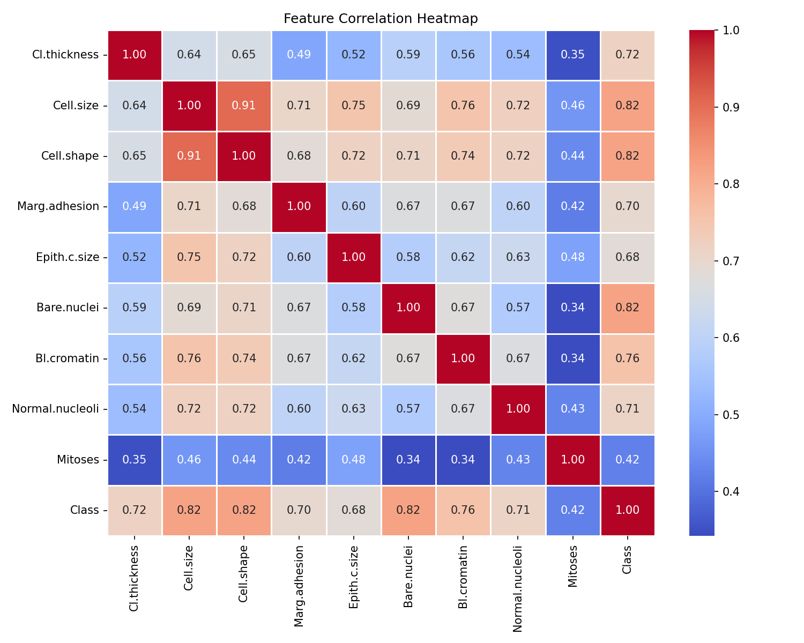
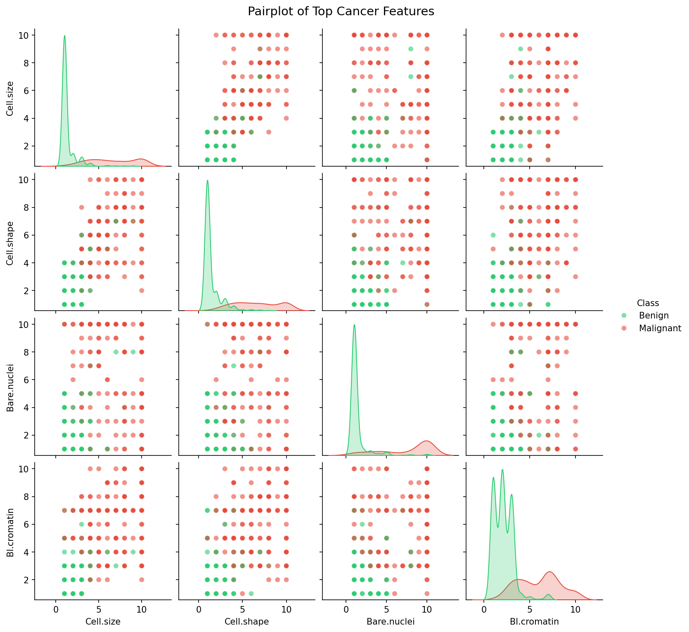
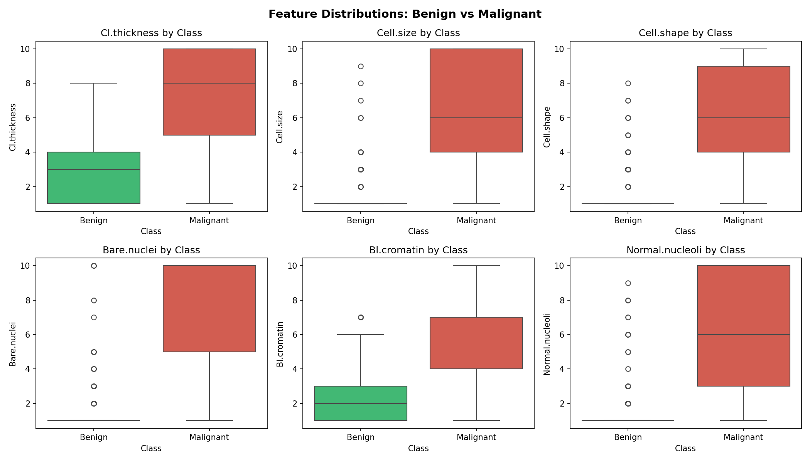
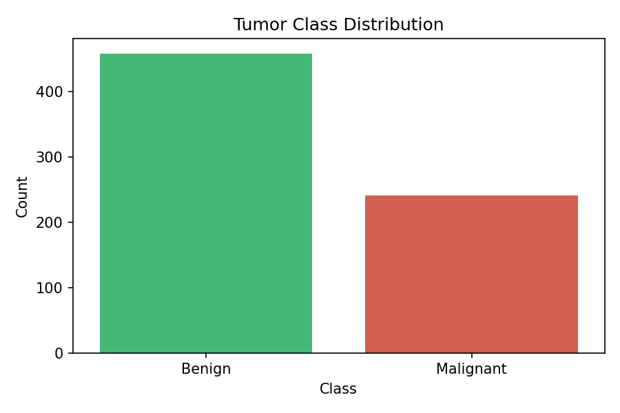

# 🧬 Breast Cancer Genomic EDA

Exploratory Data Analysis on the Wisconsin Breast Cancer dataset using Python.

## 📊 Overview
- **699 patient samples** analyzed
- **10 cellular features** explored
- Identified key markers that distinguish benign vs malignant tumors

## 🔍 Key Findings
- Bare Nuclei, Cell Shape, and Cell Size are the **top 3 malignancy indicators** (correlation > 0.81)
- Malignant tumors show consistently higher values across all features
- Dataset is **65.5% Benign** and **34.5% Malignant**

## 📈 Visualizations

| Plot | Description |
|------|-------------|
| Class Distribution | Benign vs Malignant count |
| Correlation Heatmap | Feature relationships |
| Box Plots | Feature distributions by class |
| Pairplot | Multi-feature comparison |

## 🛠️ Tools Used
- Python, Pandas, NumPy
- Matplotlib, Seaborn
- Jupyter Notebook

## 📁 Dataset
Wisconsin Breast Cancer Dataset — 699 samples, 10 features scored 1–10.

## 👤 Author
**Sai Tejaswi Gali** — Bioinformatics Student
